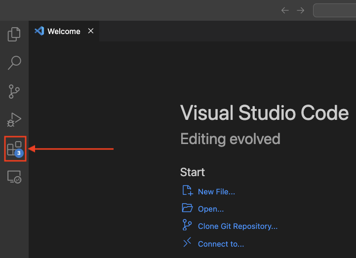
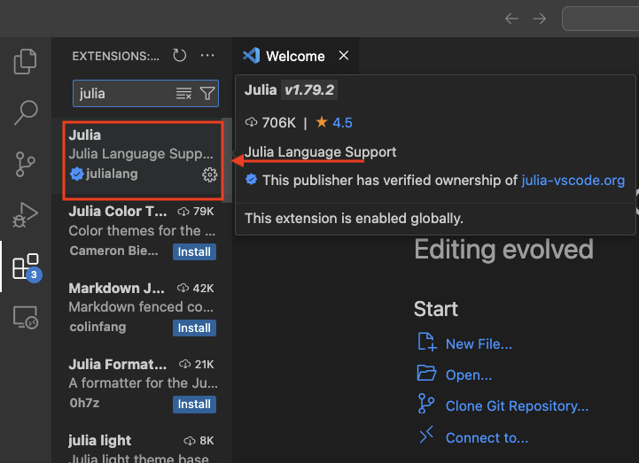

# julia-workshop

## Installation

### Install Julia at: https://julialang.org/downloads/

### Install VS Code at: https://code.visualstudio.com/download

### Install Julia extension in VS Code: 

!

## Instructions

If you are using VS Code, open the files in the VS Code folder.

If you are using Jupyter Notebook, type `julia` and press [ENTER]. Then, type `]` and then `add IJulia` and [ENTER]. After this, you can open the files in the Jupyter Notebook folder.

If you are using Google Colab, use the following links (you will have to copy the file to your own Google Drive, and run in Google Colab):

- Basics: https://shorturl.at/zulnt

- Everything you need to get started: https://shorturl.at/M5ZwC

- How to get the most out of Julia: https://shorturl.at/97Ef3

- Specific use cases: https://shorturl.at/hsr4u

## Exercises

The tutorials include exercises, the solutions of which can be found in `solutions.jl`

## Other resources

- https://github.com/Datseris/Zero2Hero-JuliaWorkshop/tree/main
- https://benlauwens.github.io/ThinkJulia.jl/latest/book.html#_preface
- https://ucidatascienceinitiative.github.io/IntroToJulia/
- https://github.com/carstenbauer/JuliaOulu20
